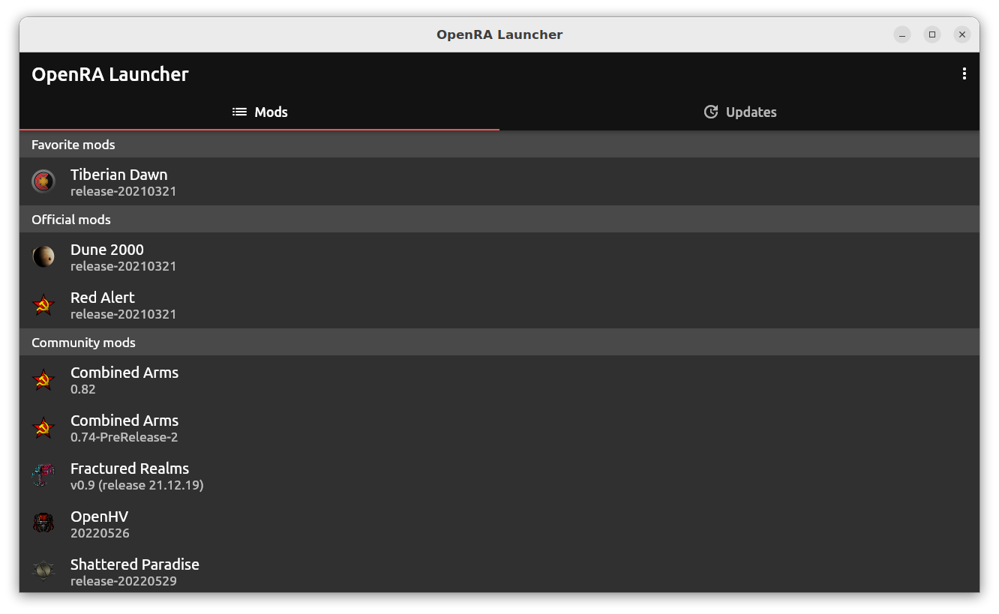
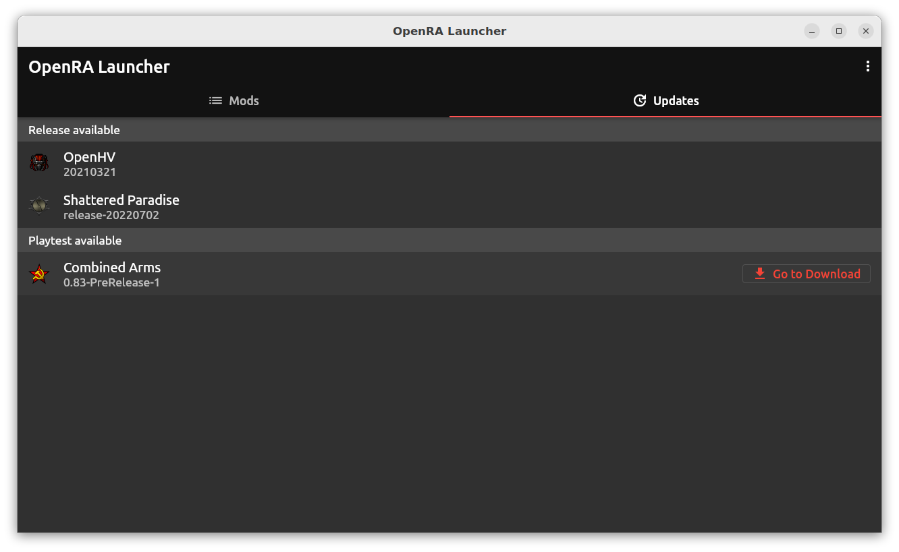

# OpenRA Launcher

A desktop application for launching OpenRA mods and tracking new releases and playtests. Runs on Windows, Linux and MacOS - head over to the releases page to [download the latest release](https://github.com/dragunoff/OpenRA-Launcher/releases/latest).

## Installation

### Windows

The application is portable - download the zip, extract to a convenient location and start the exe.

### Linux

The application is as a portable AppImage - download it, make it executable and start it.

## Development

Feeback is welcome so you can [submit a bug report or feature request](https://github.com/dragunoff/OpenRA-Launcher/issues) on the issue tracker.

glhf!
